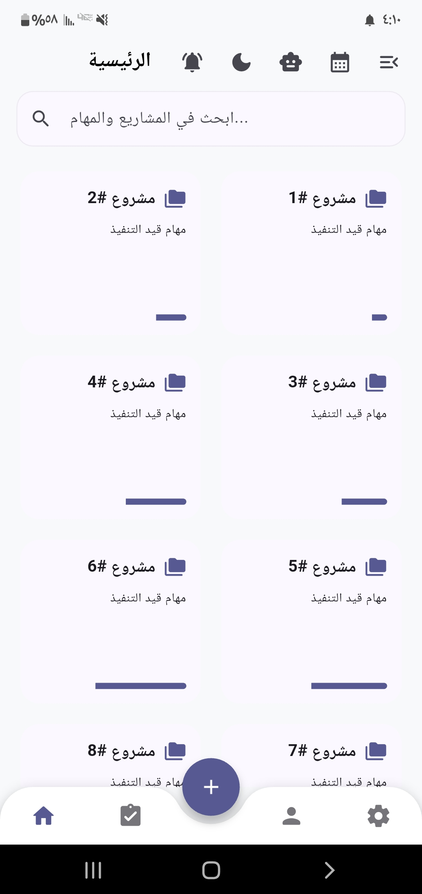
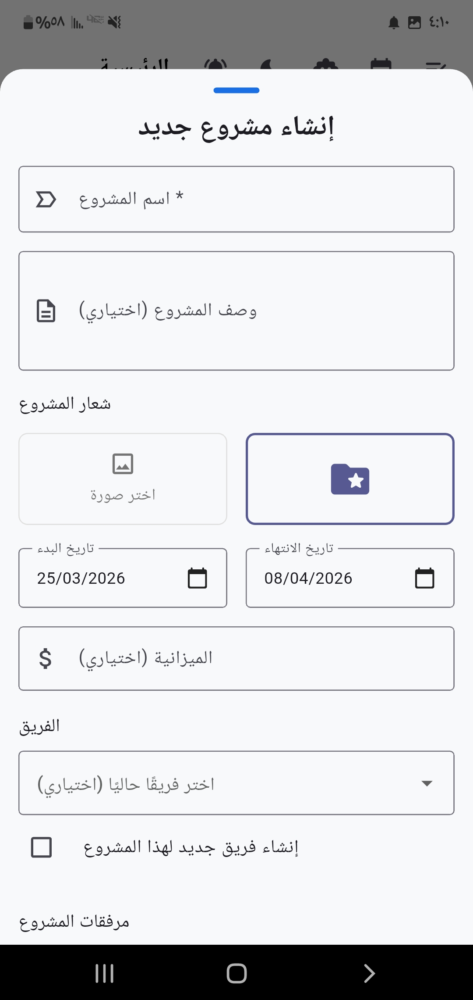
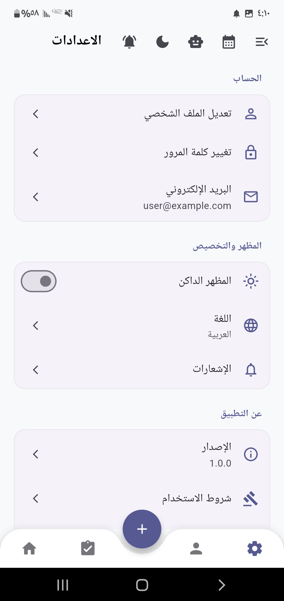
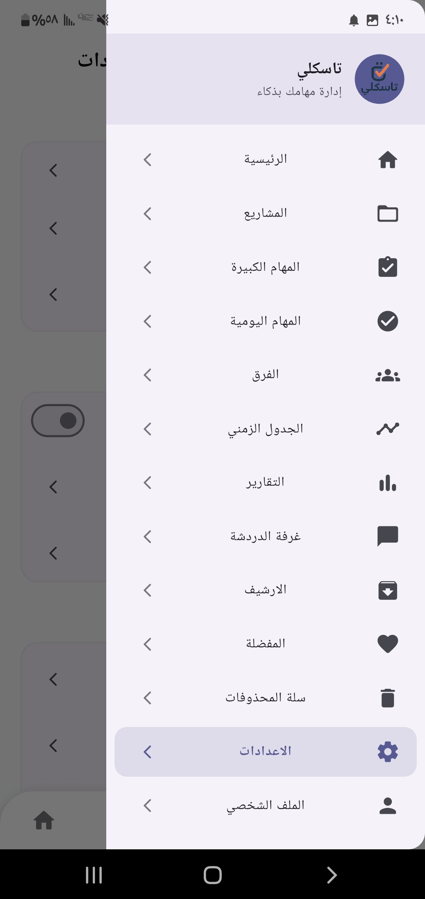
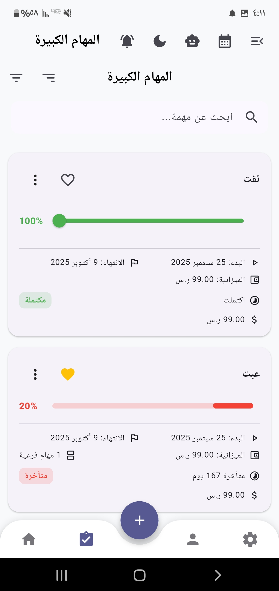

<div align="center">
  <h1>✅ Task_ly | تطبيق إدارة المهام</h1>
  <p>A Cross-Platform Task Management Mobile App | تطبيق هواتف متعدد المنصات لإدارة المهام</p>
  
  <p>
    <a href="#english">🇬🇧 English</a> • <a href="#arabic">🇸🇦 العربية</a>
  </p>

  
  
  
</div>

---

<br>

## 📸 App Screenshots | لقطات التطبيق
<div align="center">
  
  
  
  
  
</div>

<br>

<a id="english"></a>
## 🇬🇧 English Documentation

### 📌 About the Project
**Task_ly** is a sleek and efficient task management application built using the **Flutter** UI toolkit and **Firebase** backend services. It is designed to help users organize their daily routines, track progress, and boost productivity through a beautifully designed interface that works seamlessly on both Android and iOS devices.

### 🌟 Features
- **📝 Task Organization:** Create, edit, and categorize daily tasks effortlessly.
- **☁️ Cloud Sync:** Powered by Firebase Firestore, ensuring your tasks are synced across all devices in real-time.
- **🔐 User Authentication:** Secure user sign-up and login utilizing Firebase Authentication.
- **📱 Responsive UI:** A modern, intuitive design tailored for an optimal user experience on any screen size.

### ⚙️ Installation & Setup

1. **Prerequisites:**
   - Install **Flutter SDK**.
   - Ensure an IDE like **VS Code** or **Android Studio** is configured.
2. **Project Setup:**
   - Navigate to the project directory in the terminal.
   - Fetch the required packages:
     ```bash
     flutter pub get
     ```
3. **Run the Application:**
   - Connect a physical device or launch an emulator.
   - Execute:
     ```bash
     flutter run
     ```

<br>

---

<a id="arabic"></a>
## 🇸🇦 دليل الاستخدام (العربية)

### 📌 عن المشروع
**Task_ly** هو تطبيق متطور وسريع لإدارة المهام اليومية، تم تطويره باستخدام إطار عمل **Flutter** مدعوماً بخدمات **Firebase**. يهدف التطبيق إلى مساعدة المستخدمين على تنظيم جداولهم، تتبع إنجازاتهم، وزيادة إنتاجيتهم من خلال واجهة مستخدم عصرية تعمل بكفاءة على نظامي أندرويد و iOS.

### 🌟 المميزات
- **📝 إدارة المهام:** إنشاء، تعديل، وتصنيف المهام اليومية بكل سهولة.
- **☁️ المزامنة السحابية:** يعتمد على قواعد بيانات Firebase Firestore لضمان مزامنة مهامك فورياً عبر جميع أجهزتك.
- **🔐 مصادقة المستخدمين:** نظام تسجيل دخول وحماية آمن باستخدام Firebase Auth.
- **📱 واجهة متجاوبة:** تصميم جذاب وعصري يضمن أفضل تجربة استخدام على مختلف أحجام الشاشات.

### ⚙️ خطوات التثبيت والتشغيل

1. **المتطلبات الأساسية:**
   - تثبيت بيئة العمل **Flutter SDK**.
   - محرر أكواد مثل **VS Code** أو **Android Studio**.
2. **إعداد المشروع:**
   - افتح موجه الأوامر وتوجه لمسار المشروع.
   - حمل المكاتب الضرورية باستخدام الأمر:
     ```bash
     flutter pub get
     ```
3. **تشغيل التطبيق:**
   - قم بتشغيل محاكي الهواتف (Emulator) أو صِل هاتفك بالحاسوب.
   - نفذ الأمر:
     ```bash
     flutter run
     ```

<br>

---

<div align="center">
  <p>Built by <b>Waleed Mohsen Al-Ansi</b></p>
  <p>📞 +967 773 157 823</p>
</div>
